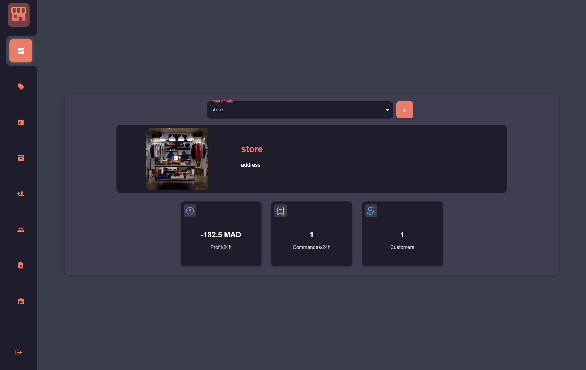

# Point Of Sale Application
This is my summer internship project

## Tech Stack
* Frontend : Nextjs
* Backend : Django (Python)

## Features : 
* Multiple POS Management
* Multiple Users Management ( Super Admin - Admin - seller ).
* Product Management 
* Order Management 
* Client Management
* Supplier Management
* Warehouse Management

# Demo Link 
[Youtube (Excuse the quality)](https://youtu.be/_HDpGb2CZTA)

# Images

